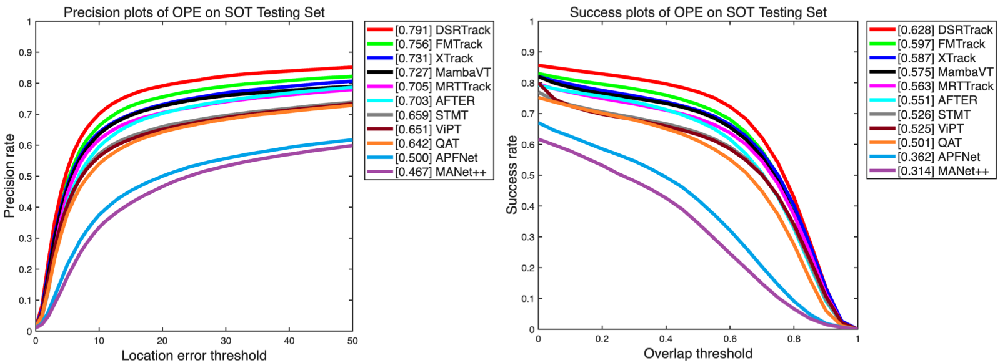
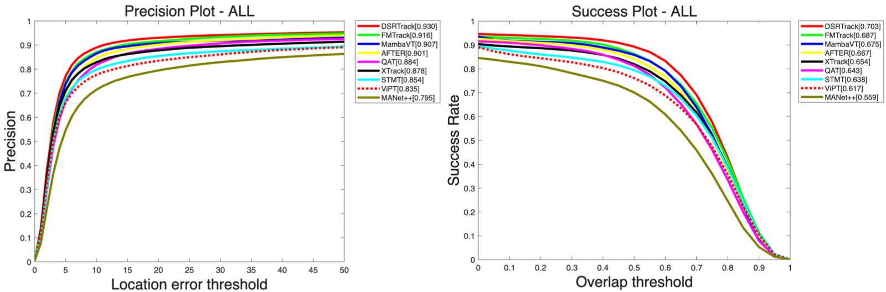

# DSRTrack

<p align="center">
  
  
  
  
</p>

📌 Official repository for **DSRTrack**.

🔓 Source code, pretrained models, tracking results, and evaluation curves are available for reproducibility.

## ✨ Highlights

- Disturbance-aware state recovery for degraded online states.
- Controlled state degradation is constructed to support cross-modal repair learning
- Anchor-guided cross-modal discrepancy modeling informs consistency-based repair
- Target-motion volatility calibrates online-state management during inference
- Evaluation results on five public RGB-T tracking benchmarks.

## 📊 Performance

| Dataset | PR | NPR | SR |
|---------|----|-----|----|
| LasHeR | 79.1 | 75.2 | 62.8 |
| RGBT210 | 92.5 | - | 68.2 |

| Dataset | MPR | MSR |
|---------|-----|-----|
| GTOT | 94.2 | 80.0 |
| RGBT234 | 93.0 | 70.3 |
| VTUAV-ST | 89.1 | 77.0 |

## 📈 Evaluation Curves

### LasHeR



### RGBT234



## 📁 Tracking Results

The raw tracking results are included directly in this repository for reproducibility:

| Dataset | Tracking results |
|---|---|
| LasHeR | [View results](./LasHeR/) |
| GTOT | [View results](./GTOT/) |
| RGBT210 | [View results](./RGBT210/) |
| RGBT234 | [View results](./RGBT234/) |
| VTUAV-ST | [View results](./VTUAV-ST/) |

## 🧠 Pretrained Models

| Training dataset | Evaluation datasets | Checkpoint |
|---|---|---|
| LasHeR | LasHeR, GTOT, RGBT210, RGBT234 | [Google Drive](https://drive.google.com/file/d/1YJRirN8lHCtrmMeOiHdXraXAJOR-LLEI/view?usp=sharing) |
| VTUAV-ST | VTUAV-ST | [Google Drive](https://drive.google.com/file/d/1TAr0trPZVc9IEbpE_-_ZRYU93_jcffJE/view?usp=sharing) |

Download the checkpoint corresponding to the target benchmark. The LasHeR-trained checkpoint is used for LasHeR, GTOT, RGBT210, and RGBT234, while the VTUAV-ST checkpoint is used for VTUAV-ST.

## 🚀 Evaluation

Evaluate DSRTrack on LasHeR, GTOT, RGBT210, and RGBT234:

```bash
bash sh/test.sh /path/to/DSRTrack-LasHeR.bin ./outputs/rgbt 0
```

Evaluate DSRTrack on VTUAV-ST:

```bash
bash sh/test_vtuav_st.sh /path/to/DSRTrack-VTUAV-ST.bin ./outputs/vtuav_st 0
```

The last argument specifies the visible GPU IDs. For example, use `0` for a single GPU or `0,1` for two GPUs.
